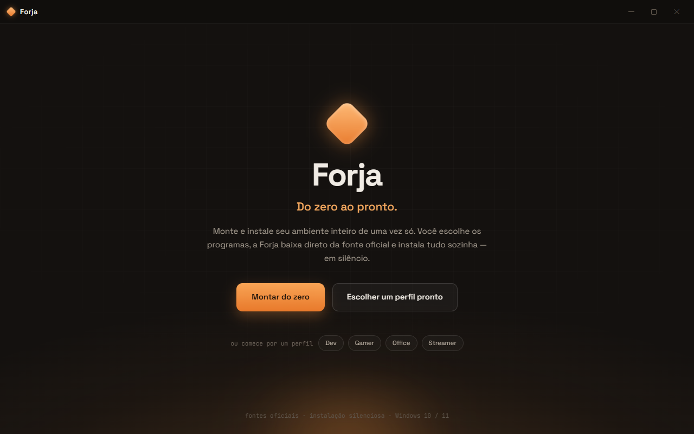

<div align="center">


# Forja

### _Do zero ao pronto._

Formatou o PC? A **Forja** monta e instala seu ambiente inteiro de uma vez só.
Você escolhe os programas, ela baixa direto da **fonte oficial** e instala tudo
**em silêncio** — e ainda salva sua seleção num arquivo portátil pra repetir na
próxima formatação com um clique.

<br/>

[](https://github.com/MrMaia/forja/releases/latest)
[](https://tauri.app)
[](https://react.dev)
[](https://www.rust-lang.org)
[](LICENSE)

[**⬇️ Baixar a última versão**](https://github.com/MrMaia/forja/releases/latest)

<br/>



</div>

<br/>

## ✨ O que ela faz

- 🗂️ **Catálogo com 120+ programas** — categorias, busca e seleção múltipla, dos
  essenciais aos de desenvolvimento, games, drivers e segurança.
- ⚡ **Instalação silenciosa via winget** — fila com progresso em tempo real,
  cronômetro e o motivo real do erro quando algo falha (lendo o log do instalador).
- 🧩 **Perfis prontos** por persona (Dev, Gamer, Office, Streamer, Estudante,
  Essencial) — comece com um pacote e ajuste o que quiser.
- 💾 **Exportar / Importar `.forja`** — salve sua seleção num arquivo portátil e
  reimporte na próxima formatação.
- 🔍 **Detecção do que já está instalado** (winget **e** por executável, pegando
  até o que foi instalado fora do winget) com botão **Atualizar** quando há versão nova.
- 🧰 **Seleção de versão** para linguagens (PHP, Java, Python, .NET, Node).
- 🖥️ **Adicionar ao PATH** com um clique para ferramentas de linha de comando.
- 🌐 **Drivers de rede** — detecta seu hardware **offline** e aponta o driver
  oficial certo (essencial num PC recém-formatado, sem internet).
- 🪛 **Ajustes do Windows** — tema escuro, extensões de arquivo, barra de tarefas,
  telemetria, plano de energia e mais (reversíveis).
- 📦 **Ícones e fontes empacotados** — funciona offline; ícone ausente vira monograma.

<br/>

## 🚀 Começando

### Usar (recomendado)

1. Baixe o **[`Forja_x64-setup.exe`](https://github.com/MrMaia/forja/releases/latest)**
   na página de releases.
2. Instale e abra. Pronto.

> O Windows pode mostrar um aviso do SmartScreen por ser um app novo e ainda não
> assinado — clique em **Mais informações → Executar assim mesmo**.

### Rodar a partir do código

**Pré-requisitos:** [Node 18+](https://nodejs.org) e [pnpm 9+](https://pnpm.io),
[Rust](https://rustup.rs) + [pré-requisitos do Tauri](https://tauri.app/start/prerequisites/)
(WebView2 + MSVC Build Tools).

```bash
pnpm install
pnpm tauri dev      # app desktop completo (Rust + React)
pnpm tauri build    # gera o instalador NSIS
```

Só quer mexer na interface, sem a toolchain Rust? A instalação é simulada no
navegador:

```bash
pnpm dev            # http://localhost:1420
```

<br/>

## 🛠️ Stack

**Tauri v2** (Rust) · **React + TypeScript + Vite + TailwindCSS** · monorepo pnpm ·
empacotamento NSIS · instalação via **winget** (e **npm** para CLIs fora do winget).

```
packages/catalog/      dados puros e reutilizáveis (schema, catálogo, perfis)
apps/desktop/
  src/                 React: telas (Onboarding, Catálogo, Perfis, Instalação,
                       Exportar/Importar, Drivers, Ajustes do Windows, Configurações)
  src-tauri/src/       Rust: catálogo, detecção (winget + exe), instalação,
                       PATH, hardware de rede e tweaks do Windows
```

<br/>

## 🗺️ Roadmap

Próximas funcionalidades planejadas:

- [ ] **Suporte a Linux e macOS** (quando possível) — hoje o foco é Windows.
- [ ] **Instalar drivers de rede automaticamente** — hoje a Forja detecta o
      hardware e indica o driver oficial; o próximo passo é instalar sozinha.
- [ ] **Instalação real de itens fora do winget** — apps/drivers com instalador
      próprio (download oficial + elevação UAC), em vez de só abrir o site.
- [ ] **Mais ajustes do Windows** (e ajustes de Linux/macOS no futuro).
- [ ] **`postInstall`** — rodar comandos após instalar (ex.: `corepack enable`,
      extensões do VS Code, configs).
- [ ] **Tamanhos de download reais** + checagem de espaço em disco.
- [ ] **Internacionalização (EN)** e **landing page** do projeto.

<br/>

## 📦 Adicionar um programa ao catálogo

Edite **`packages/catalog/catalog.json`** e acrescente um objeto:

```json
{
  "id": "obsidian",
  "name": "Obsidian",
  "category": "Produtividade",
  "description": "Notas em markdown com grafo de conhecimento.",
  "icon": { "label": "Ob", "bg": "#2f4a3a", "fg": "#cfe6d8" },
  "iconUrl": null,
  "winget": "Obsidian.Obsidian",
  "fallbackUrl": "https://obsidian.md/download",
  "postInstall": []
}
```

A validação serde roda nos testes do Rust:

```bash
cd apps/desktop/src-tauri && cargo test
```

<br/>

## 📄 Licença

[MIT](LICENSE) © Allan Maia

<div align="center"><sub>Forja · do zero ao pronto.</sub></div>
